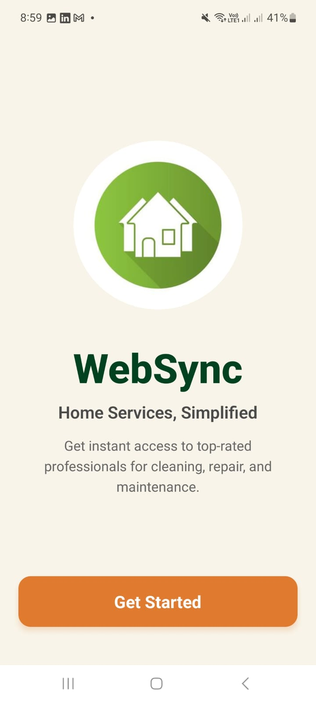
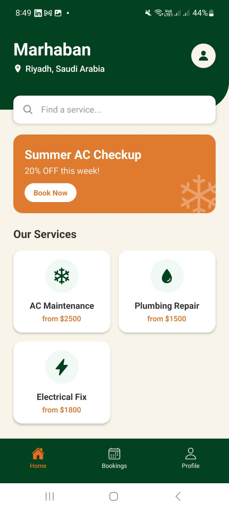
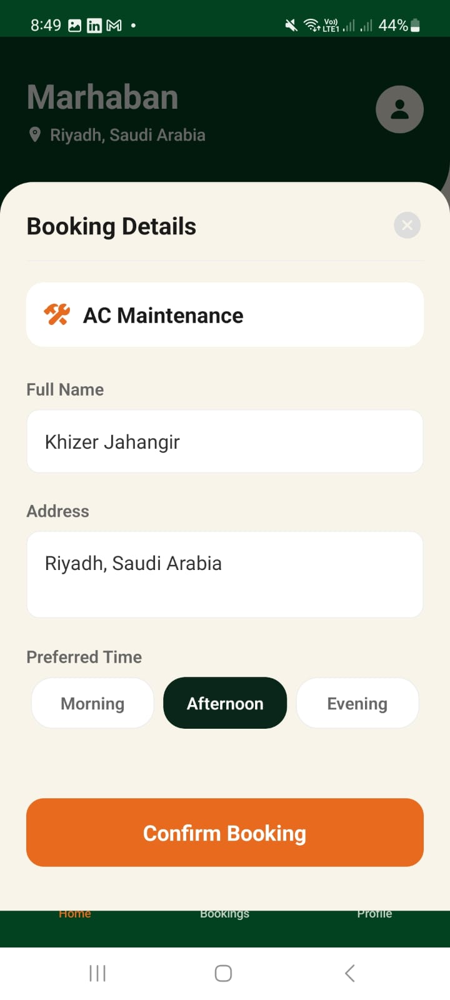
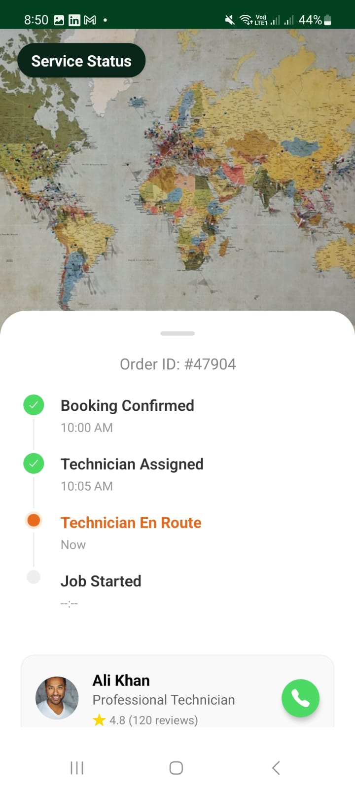

# WebSync - Home Services Platform

A modern, full-stack home services application built for the Saudi market. This platform connects users with verified professionals for AC maintenance, plumbing, electrical work, and cleaning.


## 📱 Features

### Mobile App (User)
- **Deep Green & Cream Theme**: Premium "Dark Forest" aesthetic tailored for regional preferences.
- **Service Booking**: Interactive form with Date/Time selection and location details.
- **Live Tracking**: Real-time status timeline with "En Route" pulse animation.
- **Visuals**: Saudi-centric content (Riyadh location, localized offers).
- **Tech Stack**: React Native (Expo), React Navigation v6, Axios.

### Backend (API)
- **RESTful API**: Node.js & Express.
- **Database**: MongoDB (Mongoose schemas for Services and Bookings).
- **Seeding**: Auto-seeds dummy service data for instant setup.

### Admin Dashboard (Web)
- **Order Management**: View and manage incoming service requests.
- **Technician Assignment**: Assign professionals to specific jobs.
- **Tech Stack**: React.js (Vite), Tailwind CSS.

## 🚀 Getting Started

### Prerequisites
- Node.js (v18+)
- MongoDB (Local or Atlas)
- Expo Go (on phone)

### Installation

1. **Clone the Repository**
   ```bash
   git clone https://github.com/yourusername/websync.git
   cd websync
   ```

2. **Backend Setup**
   ```bash
   cd backend
   npm install
   # Create .env file with MONGODB_URI=mongodb://localhost:27017/websync
   node server.js
   ```

3. **Mobile App Setup**
   ```bash
   cd mobile-app
   npm install
   npx expo start --clear
   ```
   *Scan the QR code with Expo Go to run on your phone.*

## 📸 Screenshots

| Welcome Screen | Home Screen | Booking Flow | Tracking |
|:---:|:---:|:---:|:---:|
|  |  |  |  |

> *Note: Place your screenshots in a `screenshots` folder in the root directory.*

## 🛠️ Configuration
- **Network**: The app uses `src/config.js` to define the backend URL. Ensure `API_URL` points to your machine's IP address (e.g., `http://192.168.1.12:5000`) if running locally.
- **Android APK**: `app.json` is configured with `usesCleartextTraffic` for local testing.

## License
MIT
